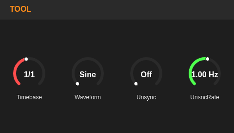
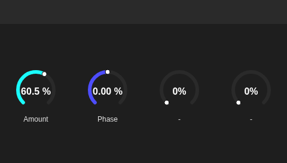

# Maschine Mk3 Bitwig Controller (Proof-of-Concept)

A high-performance, Rust-based Maschine Mk3 controller for Bitwig Studio, utilizing HID communication via [`encdr`](https://github.com/RufusIbiza/Encdr) to provide rich, full-color feedback on the Mk3's dual screens.

<p align="center">
  
  
</p>

This project is currently a proof-of-concept on the road to getting the Maschine Mk3 working beautifully with Bitwig.

## Architectural Approach (Rust + OSC)

Historically, some controller extensions (like the excellent DrivenByMoss, which served as an inspiration for the goals of this project) have relied entirely on Bitwig's Java extension API. While powerful, the Java sandbox imposes limitations on direct hardware access, especially for high-resolution tasks like rendering UI on external displays.

This project uses a different architecture:
1. **Bitwig Controller Script (`encdr-maschine-mk3.control.js`)**: A lightweight script running inside Bitwig. Its sole responsibility is to watch for changes in Bitwig's state (track selection, parameters, transport) and broadcast them over UDP using Open Sound Control (OSC). It also listens for incoming OSC commands to control Bitwig.
2. **Rust Backend Engine**: A standalone, high-performance Rust application that communicates directly with the Maschine hardware via USB HID using the [`encdr`](https://github.com/RufusIbiza/Encdr) library. It acts as an OSC server/client, receiving state from Bitwig, rendering beautiful WebKit-based UIs to the Maschine screens, and sending hardware button/encoder events back to Bitwig with near-zero latency.

By moving the heavy lifting (like rendering screen UIs) out of the Bitwig sandbox and into a native Rust application, we unlock the full potential of the Maschine Mk3's dual displays.

## Current Features (Phase 1: Device Control)

- **Bi-directional OSC Communication**: Seamlessly syncs state between Bitwig and the Maschine Mk3 hardware with near-zero latency.
- **Dynamic Dual Screens**: 
  - The left and right 480x272 screens render Bitwig-styled, dark-mode UIs using `encdr-view`.
  - Displays the currently selected device's name.
  - Displays the names and real-time values of all 8 macro/parameters.
  - Automatically updates the UI when parameters are automated or changed in Bitwig.
  - Live modulation indicator: a white tick on each knob tracks the modulated value in real time (e.g. LFOs/envelopes mapped to a macro).
- **Hardware Integration**:
  - The 8 infinite encoders under the screens smoothly map to the Bitwig device parameters.
  - The `LEFT` and `RIGHT` arrow buttons navigate through the devices on the currently selected track.
  - **Transport Controls**:
    - **PLAY**: Starts playback from current cuepoint. Reflects live playback status (ON when playing, OFF when stopped).
    - **STOP**: Stops playback. Reflects stopped status (ON when stopped, OFF when playing).
    - **REC**: Toggles arranger recording from playmarker. Reflects live record status.
    - **SHIFT + REC**: Turns on count-in recording.
    - **RESTART**: Returns to current cuepoint and continues playback if playing; sets playhead to 0 and plays if stopped.
    - **SHIFT + RESTART**: Toggles arranger looping on/off.

## Roadmap

We are implementing hardware logic in phases to build a comprehensive workflow.

### Phase 2: Mixer & Track Control
- Implement track navigation (Next/Prev track).
- Map encoders to Volume, Pan, and Sends.
- Utilize the screens to render level meters and track colors.
- Map hardware buttons to Mute, Solo, Arm, and Select.

### Phase 3: Sequencer & Pad Modes
- Implement core pad modes:
  - **Play Mode**: 4x4 chromatic or scale-based melodic playing.
  - **Drum Mode**: Standard drum rack triggering.
  - **Step Sequencer**: Full 16-step sequencing on the pads, with screens displaying clip/note information.

### Phase 4: Browser Integration
- Utilize the screens to navigate Bitwig's preset/device browser.
- Map the 4-D encoder (joystick) for fast scrolling and loading.

## Setup & Installation Instructions

**Requirements:**
- Bitwig Studio 5.1 or newer (Uses API version 25).
- Rust (`cargo`) installed on your system.
- The **Encdr** repository cloned as a sibling directory to this project (required by `Cargo.toml` path dependencies, i.e. in the same parent directory as this project, or modify the Cargo.toml file if you want to install `encdr` elsewhere).

### OS-Specific Considerations

#### Linux
To allow `encdr` to communicate with the USB hardware without requiring `sudo`, you must configure `udev` rules. 
Create a file (e.g. `/etc/udev/rules.d/99-maschine.rules`) and add the following line to grant access to the Native Instruments Vendor ID (`17cc`):
```udev
SUBSYSTEM=="usb", ATTRS{idVendor}=="17cc", MODE="0666"
```
After saving the file, reload the rules:
```bash
sudo udevadm control --reload-rules
sudo udevadm trigger
```
If you are using the WebView screens (`encdr-view`), you also need to install the associated system dependencies. On Debian/Ubuntu based systems:
```bash
sudo apt install libwebkit2gtk-4.1-dev libcairo2-dev
```

#### Windows / macOS
Native Instruments installs background services to manage their hardware. These services will likely claim the Maschine Mk3, preventing this application from connecting to it.
Before running this software, you will probably need to terminate or disable these background processes (e.g., `NIHardwareHelper.exe`, `NIHostIntegrationAgent.exe`, or `NIHardwareAgent` depending on your OS) via the Task Manager (Windows) or Activity Monitor (macOS) to avoid USB conflicts.

Follow these steps to get the controller working with your setup.

### 1. Install the Bitwig Extension Script
The bridge script `encdr-maschine-mk3.control.js` acts as an OSC server within Bitwig.
You must copy this script into your Bitwig Controller Scripts directory.

On Linux / macOS:
```bash
cp bitwig-extension/encdr-maschine-mk3.control.js "$HOME/Bitwig Studio/Controller Scripts/"
# Or alternatively into your Extensions folder:
# cp bitwig-extension/encdr-maschine-mk3.control.js "$HOME/Bitwig Studio/Extensions/"
```

On Windows, the paths are typically:
- `C:\Users\<YourUsername>\Documents\Bitwig Studio\Controller Scripts\`
- `C:\Users\<YourUsername>\Documents\Bitwig Studio\Extensions\`

### 2. Enable the Controller in Bitwig
1. Open Bitwig Studio.
2. Go to **Settings > Controllers**.
3. Click **Add controller manually**.
4. Select **Rufus** -> **Maschine Mk3 (OSC)** from the dropdown menus.
5. Set its MIDI input/output to any virtual or dummy port (the script relies purely on OSC and does not use traditional MIDI, but Bitwig requires ports to be assigned to enable the controller).

### 3. Run the Rust Backend Application
Ensure your Maschine Mk3 is plugged in and powered on. Start the Rust application to connect to the hardware and Bitwig:
```bash
cd machine-bitwig
cargo run
```
You should see "Connected to Maschine Mk3" in the terminal, and the screens on the hardware should light up!

## License

This project is licensed under the [GNU General Public License v3.0](LICENSE).
